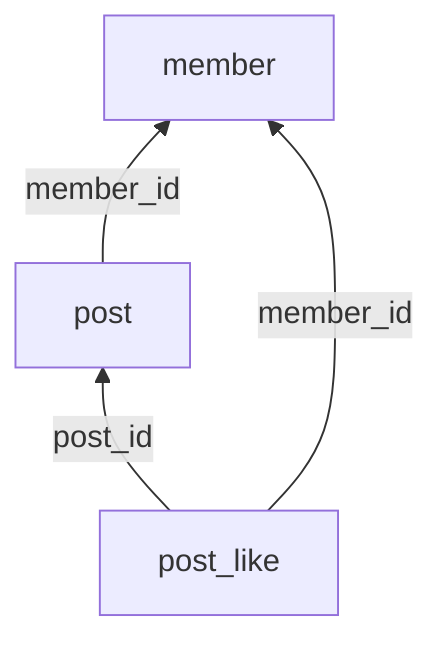

# 資料庫初始化手冊

## 運作方式

每次啟動應用程式時(`app.db.reset=true` 的情況下):

1. `DatabaseResetter` 在 Spring 啟動前,用純 JDBC 連到 master,把整個 `pawpostdb` **砍掉重建**(⚠ 正式專案絕對禁止的技巧,原因見該類別的註解)。
2. Spring 依「檔名字母順序」執行 `schema/*.sql` 建表、再執行 `data/*.sql` 塞假資料。
3. `Initialize.java` 把 `photo/` 下的示範照片載入對應 id 的貼文。

所以:**資料庫是拋棄式的**——重啟就重建。想暫時保留手動輸入的資料(例如 demo 前),把 `application.properties` 的 `app.db.reset` 改成 `false`。
注意:專案掛了 devtools,**IDE 每次存檔觸發熱重啟也會重置資料庫**,這是刻意設計。

## 檔案編號規則

```
schema/10_member.sql       ← 不依賴任何表
schema/20_post.sql         ← 依賴 member
schema/30_post_like.sql    ← 依賴 member、post
data/  10_member.sql       ← data 與 schema 同名同編號
```

- **編號必須大於所有你 FK 指向的表**(編號即依賴深度)。
- 編號以 10 為間隔,之後要在兩層中間插新表時用 15、25,不必幫別的檔案改名。
- 同層互不依賴的表可以用相同編號(如 `30_post_like.sql`、`30_comment.sql`)。
- **一人負責自己的領域檔案**,避免多人共編同一檔造成 git 衝突。

## 依賴地圖(新增表時請順手更新)



## 新增一張表的 SOP

1. 在 `schema/` 建 `NN_你的表.sql`,編號大於所有依賴的表。
2. 在 `data/` 建同名檔,照這個模板寫:

   ```sql
   SET IDENTITY_INSERT 你的表 ON;
   INSERT INTO 你的表 (id, ...) VALUES
   (1, ...);                          -- id 明確寫死,FK 才可搜尋、可維護
   SET IDENTITY_INSERT 你的表 OFF;
   DBCC CHECKIDENT ('你的表', RESEED, 999);   -- 執行期資料從 1000 開始
   ```

3. 更新上面的依賴地圖。
4. 重啟驗證。

## 刪除一張表的 SOP

1. 全域搜尋 `REFERENCES 你的表名`,找出所有依賴你的下游表。
2. 由編號大的往小刪:先刪下游的 schema/data 檔,再刪自己的。
3. 重啟——**啟動失敗的錯誤訊息就是漏刪清單**(這是拋棄式資料庫送你的安全網)。

刪「特定一筆假資料」同理:全域搜尋該 id 的 FK 引用,把下游引用一起清掉。

## SQL 撰寫注意事項(H2 沒有、真 SQL Server 才有的雷)

| 事項 | 說明 |
|---|---|
| 中文要 `N'...'` | 沒加 N 前綴的中文字串會變 `???` |
| 文字欄位用 `NVARCHAR` | 理由同上 |
| 布林用 `BIT`(0/1) | SQL Server 沒有 BOOLEAN |
| 二進位佔位用 `0x` | 字串 `''` 不能隱式轉 VARBINARY |
| **禁用 `GO`** | `GO` 是 SSMS 的批次指令、不是 SQL;Spring 的腳本執行器看不懂,從 SSMS 貼範例過來記得刪掉 |
| CASCADE 只能一條路 | 一張表若有兩條 ON DELETE CASCADE 路徑通到同一祖先,建表直接報錯 1785(範例:`30_post_like.sql`) |

## 本機 SQL Server Express 安裝雷點(每一個都有人踩)

1. **混合驗證 + sa**:安裝時選「混合模式」並設定 sa 密碼;裝完才要開的話,在 SSMS 伺服器屬性→安全性改混合模式,並啟用 sa 帳號。
   注意:安裝程式會強制要求「複雜密碼」,`1234` 這種教學用弱密碼過不了,要事後用 SQL 改:
   `ALTER LOGIN sa WITH PASSWORD='1234', CHECK_POLICY=OFF;`(關閉政策檢查——這也只有教學環境可以這樣做)。
2. **TCP/IP 預設關閉**:開啟「SQL Server 組態管理員」→ 網路組態 → 啟用 TCP/IP,然後重啟 SQL Server 服務。JDBC 走 TCP,不開必連不上。
3. **Express 預設用動態 port**:同一個 TCP/IP 設定裡,把「IPAll」的動態 port 清空、TCP 通訊埠固定填 `1433`。
4. **連線字串必帶 `trustServerCertificate=true`**:本機是自簽憑證,不信任它,新版 JDBC 驅動(預設加密)會握手失敗。
